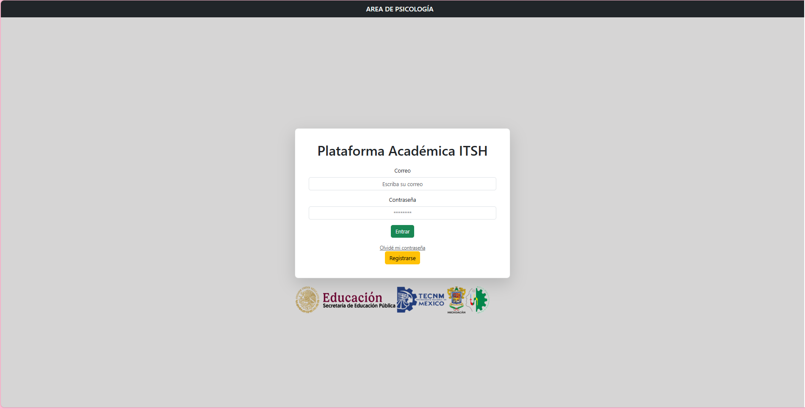

# Junior Developer

### Habilidades técnicas: Laravel, PHP, Git y GitHub, Docker, MySQL, Workbench, JavaScript, C++, Java,C#, HTML, CSS, Bootstrap
### Educación
Institución: Instituto Tecnológico Superior de Huetamo
Carrera: Ingeniería en Sistemas Computacionales
Especialidad: Gestión y desarrollo de tecnologías integrales
Periodo: 2024 actual

### Experiencia profesional 
**Empresa: Sombrerería Morelita**
• Giro: Comercio de Sombreros artesanales
• Periodo: 2023
• Responsabilidad: Atención al cliente
• Actividades:
• Asesoramiento sobre productos
• Asistencia en la selección y prueba de sombreros

**Empresa: BEST REFERENCE**
• Puesto: Junior Developer
• Periodo: 19 de junio – 19 de diciembre del 2024
• Responsabilidades:
• Desarrollo de una plataforma para la certificación de 
tequila usando Laravel (arquitectura MVC).
• Manejo de bases de datos MySQL y tecnologías como 
PHP, AJAX, y JavaScript.
• Control de versiones con Git y GitHub.

### Proyectos

**Pagina Statica de Sombrererria Morelita**
[Publicacion](https://sombrereriamorelita.netlify.app/)

**Plataforma-Psicologia**

